# Documento de Arquitetura - Sistema de Gestão de Grupos de Networking

## 1. Visão Geral

Sistema completo de gestão para grupos de networking empresarial, implementado com Next.js, TypeScript, Prisma ORM, PostgreSQL, Docker, Zod e React Query.

O sistema abrange todo o ciclo de vida de um grupo de networking: desde a admissão de novos membros, passando pela comunicação interna, geração de negócios através de indicações, acompanhamento de performance, até o controle financeiro de mensalidades.

### 1.1 Objetivos

**1. Gestão de Membros:**
- Permitir que usuários manifestem interesse em participar do grupo
- Fornecer área administrativa para aprovar/rejeitar intenções
- Gerar convites únicos com tokens temporários
- Permitir cadastro completo apenas via token válido
- Gerenciar perfis e status de membros

**2. Comunicação e Engajamento:**
- Publicar avisos e comunicados para os membros
- Controlar presença em reuniões através de check-in
- Manter histórico de participação

**3. Geração de Negócios:**
- Facilitar indicações e referências de negócios entre membros
- Rastrear status das indicações (enviada, em negociação, fechada)
- Registrar agradecimentos públicos por negócios concretizados
- Calcular valor gerado pelo grupo

**4. Acompanhamento e Performance:**
- Controlar reuniões 1 a 1 entre membros
- Exibir dashboards de desempenho individual e coletivo
- Gerar relatórios por período (semanal, mensal, acumulado)
- Métricas de engajamento e produtividade

**5. Financeiro:**
- Gerar e controlar mensalidades dos membros
- Rastrear status de pagamento
- Relatórios financeiros do grupo

## 2. Arquitetura do Sistema

### 2.1 Diagrama de Arquitetura Geral

```
┌─────────────────────────────────────────────────────────────────────────┐
│                    ARQUITETURA DO SISTEMA                               │
└─────────────────────────────────────────────────────────────────────────┘

┌─────────────────────────────────────────────────────────────────────────┐
│                           FRONTEND (Next.js 14)                         │
├─────────────────────────────────────────────────────────────────────────┤
│                                                                         │
│  ┌──────────────┐  ┌──────────────┐  ┌──────────────┐                │
│  │   Páginas    │  │  Componentes │  │  React Query │                │
│  │   Públicas   │  │      UI      │  │    Hooks     │                │
│  └──────────────┘  └──────────────┘  └──────────────┘                │
│                                                                         │
│  ┌──────────────┐  ┌──────────────┐  ┌──────────────┐                │
│  │   Páginas    │  │  Validação   │  │    Estado    │                │
│  │    Admin     │  │     Zod      │  │    Global    │                │
│  └──────────────┘  └──────────────┘  └──────────────┘                │
│                                                                         │
└────────────────────────────┬────────────────────────────────────────────┘
                             │ HTTP/REST
                             ▼
┌─────────────────────────────────────────────────────────────────────────┐
│                      BACKEND API (Next.js API Routes)                   │
├─────────────────────────────────────────────────────────────────────────┤
│                                                                         │
│  ┌────────────┐  ┌────────────┐  ┌────────────┐  ┌────────────┐      │
│  │  Gestão de │  │Comunicação │  │  Geração   │  │Performance │      │
│  │   Membros  │  │Engajamento │  │ Negócios   │  │  Tracking  │      │
│  └────────────┘  └────────────┘  └────────────┘  └────────────┘      │
│                                                                         │
│  ┌────────────┐  ┌────────────┐  ┌────────────┐  ┌────────────┐      │
│  │ Financeiro │  │Autenticação│  │ Validação  │  │   Email    │      │
│  │            │  │   Admin    │  │    Zod     │  │  Service   │      │
│  └────────────┘  └────────────┘  └────────────┘  └────────────┘      │
│                                                                         │
└────────────────────────────┬────────────────────────────────────────────┘
                             │ Prisma ORM
                             ▼
┌─────────────────────────────────────────────────────────────────────────┐
│                      BANCO DE DADOS (PostgreSQL)                        │
├─────────────────────────────────────────────────────────────────────────┤
│                                                                         │
│  ┌────────────┐  ┌────────────┐  ┌────────────┐  ┌────────────┐      │
│  │ Intentions │  │  Members   │  │   Notices  │  │  Meetings  │      │
│  └────────────┘  └────────────┘  └────────────┘  └────────────┘      │
│                                                                         │
│  ┌────────────┐  ┌────────────┐  ┌────────────┐                     │
│  │Attendances │  │  Thanks    │  │ OneOnOnes  │                     │
│  └────────────┘  └────────────┘  └────────────┘                     │
│                                                                         │
│  ┌────────────┐  ┌────────────┐  ┌────────────┐  ┌────────────┐      │
│  │Memberships │  │ EmailLogs  │  │   Users    │  │  Sessions  │      │
│  └────────────┘  └────────────┘  └────────────┘  └────────────┘      │
│                                                                         │
│  ┌────────────┐  ┌────────────┐                                       │
│  │  Accounts  │  │Verification│                                       │
│  └────────────┘  └────────────┘                                       │
│                                                                         │
└─────────────────────────────────────────────────────────────────────────┘
```

### 2.1.1 Diagrama em Mermaid

```mermaid
graph TB
    subgraph Frontend["FRONTEND - Next.js"]
        direction TB
        PUB[Páginas Públicas]
        MEMBER[Páginas Membros]
        ADMIN[Páginas Admin]
        UI[Componentes UI]
        RQ[React Query]
        ZOD[Validação Zod]
    end

    subgraph Backend["BACKEND - Next.js API Routes"]
        direction TB
        
        subgraph APIs["APIs por Módulo"]
            API1[Gestão Membros]
            API2[Comunicação]
            API3[Negócios]
            API4[Performance]
            API5[Financeiro]
        end
        
        AUTH[Autenticação]
        EMAIL[Email Service]
    end

    subgraph Database["DATABASE - PostgreSQL + Prisma"]
        direction TB
        
        subgraph DB1["Gestão"]
            T1[(Intentions)]
            T2[(Members)]
        end
        
        subgraph DB2["Comunicação"]
            T3[(Notices)]
            T4[(Meetings)]
            T5[(Attendances)]
        end
        
        subgraph DB3["Negócios"]
            T6[(Thanks)]
        end
        
        subgraph DB4["Performance"]
            T7[(OneOnOnes)]
        end
        
        subgraph DB5["Financeiro"]
            T8[(Memberships)]
        end
        
        subgraph DB6["Autenticação"]
            T9[(Users)]
            T10[(Sessions)]
            T11[(Accounts)]
            T12[(Verification)]
        end
        
        subgraph DB7["Sistema"]
            T13[(EmailLogs)]
        end
    end

    %% Conexões Frontend
    PUB -->|HTTP/REST| API1
    MEMBER -->|HTTP/REST| API1
    MEMBER -->|HTTP/REST| API2
    MEMBER -->|HTTP/REST| API3
    MEMBER -->|HTTP/REST| API4
    ADMIN -->|Better Auth| AUTH
    ADMIN -->|HTTP/REST| API1
    ADMIN -->|HTTP/REST| API2
    ADMIN -->|HTTP/REST| API5
    
    UI -.->|usa| RQ
    RQ -.->|valida| ZOD

    %% Conexões Backend
    AUTH -.->|protege| API1
    AUTH -.->|protege| API2
    AUTH -.->|protege| API5
    
    API1 -->|Prisma| T1
    API1 -->|Prisma| T2
    API2 -->|Prisma| T3
    API2 -->|Prisma| T4
    API2 -->|Prisma| T5
    API3 -->|Prisma| T6
    API4 -->|Prisma| T7
    API5 -->|Prisma| T8
    AUTH -->|Prisma| T9
    AUTH -->|Prisma| T10
    AUTH -->|Prisma| T11
    AUTH -->|Prisma| T12
    EMAIL -->|Prisma| T13

    %% Estilos
    style Frontend fill:#e3f2fd,stroke:#1976d2,stroke-width:3px
    style Backend fill:#fff3e0,stroke:#f57c00,stroke-width:3px
    style Database fill:#e8f5e9,stroke:#388e3c,stroke-width:3px
    
    style PUB fill:#90caf9
    style MEMBER fill:#90caf9
    style ADMIN fill:#ef5350
    style UI fill:#64b5f6
    style RQ fill:#64b5f6
    style ZOD fill:#64b5f6
    
    style APIs fill:#ffe0b2
    style API1 fill:#ffb74d
    style API2 fill:#ffb74d
    style API3 fill:#ffb74d
    style API4 fill:#ffb74d
    style API5 fill:#ffb74d
    style AUTH fill:#ff8a65
    style EMAIL fill:#ff8a65
    
    style DB1 fill:#c8e6c9
    style DB2 fill:#c8e6c9
    style DB3 fill:#c8e6c9
    style DB4 fill:#c8e6c9
    style DB5 fill:#c8e6c9
    style DB6 fill:#fff9c4
    style DB7 fill:#e0e0e0
    style T1 fill:#81c784
    style T2 fill:#81c784
    style T3 fill:#81c784
    style T4 fill:#81c784
    style T5 fill:#81c784
    style T6 fill:#81c784
    style T7 fill:#81c784
    style T8 fill:#81c784
    style T9 fill:#fff59d
    style T10 fill:#fff59d
    style T11 fill:#fff59d
    style T12 fill:#fff59d
    style T13 fill:#bdbdbd
```



### 2.2 Estrutura de Componentes (Frontend)

```
┌─────────────────────────────────────────────────────────────────┐
│                      ESTRUTURA DO PROJETO                       │
└─────────────────────────────────────────────────────────────────┘

src/
├── app/                                    # Next.js App Router
│   ├── api/                                # API Routes
│   │   ├── auth/
│   │   │   └── [...all]/route.ts           # Better Auth routes
│   │   ├── intentions/
│   │   │   ├── route.ts                    # POST, GET intentions
│   │   │   ├── approve/route.ts            # POST approve
│   │   │   ├── reject/route.ts             # POST reject
│   │   │   └── status/route.ts             # GET status by email
│   │   ├── members/
│   │   │   ├── route.ts                    # GET members list
│   │   │   ├── [id]/route.ts               # GET, PATCH, DELETE member
│   │   │   ├── register/route.ts           # POST register
│   │   │   └── validate-token/route.ts     # GET validate
│   │   ├── notices/
│   │   │   ├── route.ts                    # GET, POST notices
│   │   │   └── [id]/route.ts               # GET, PATCH, DELETE notice
│   │   ├── meetings/
│   │   │   ├── route.ts                    # GET, POST meetings
│   │   │   ├── [id]/route.ts               # GET, PATCH, DELETE meeting
│   │   │   └── [id]/check-in/route.ts      # POST check-in
│   │   ├── attendances/
│   │   │   ├── route.ts                    # GET attendances
│   │   │   └── stats/route.ts              # GET attendance stats
│   │   ├── thanks/
│   │   │   ├── route.ts                    # GET, POST thanks
│   │   │   └── [id]/route.ts               # GET, DELETE thank
│   │   ├── one-on-ones/
│   │   │   ├── route.ts                    # GET, POST one-on-ones
│   │   │   └── [id]/route.ts               # GET, PATCH one-on-one
│   │   ├── memberships/
│   │   │   ├── route.ts                    # GET, POST memberships
│   │   │   ├── [id]/route.ts               # GET, PATCH membership
│   │   │   └── [id]/pay/route.ts           # POST payment
│   │   ├── dashboard/
│   │   │   ├── member/[id]/route.ts        # GET member dashboard
│   │   │   ├── group/route.ts              # GET group dashboard
│   │   │   └── reports/route.ts            # GET reports
│   │   └── emails/route.ts                 # GET email logs
│   │
│   ├── (public)/                           # Public routes
│   │   ├── page.tsx                        # Home (intention form)
│   │   ├── login/page.tsx                  # Login page
│   │   ├── signup/page.tsx                 # Signup page
│   │   ├── pending/page.tsx                # Pending approval page
│   │   ├── register/page.tsx               # Registration page (token)
│   │   ├── intentions/
│   │   │   └── status/page.tsx             # Check intention status
│   │   └── layout.tsx                      # Public layout
│   │
│   ├── (member)/                           # Member routes (auth required)
│   │   ├── dashboard/page.tsx              # Member dashboard
│   │   ├── notices/page.tsx                # Notices list
│   │   ├── meetings/page.tsx               # Meetings list
│   │   ├── thanks/page.tsx                 # Thanks feed
│   │   ├── one-on-ones/page.tsx            # 1-on-1 meetings
│   │   ├── profile/page.tsx                # My profile
│   │   └── layout.tsx                      # Member layout
│   │
│   ├── (admin)/                            # Admin routes
│   │   ├── admin/
│   │   │   ├── page.tsx                    # Admin dashboard
│   │   │   ├── intentions/page.tsx         # Manage intentions
│   │   │   ├── members/page.tsx            # Manage members
│   │   │   ├── notices/
│   │   │   │   ├── page.tsx                # Manage notices
│   │   │   │   └── new/page.tsx            # Create notice
│   │   │   ├── meetings/
│   │   │   │   ├── page.tsx                # Manage meetings
│   │   │   │   └── new/page.tsx            # Create meeting
│   │   │   ├── memberships/page.tsx        # Financial control
│   │   │   ├── reports/page.tsx            # Reports
│   │   │   └── emails/page.tsx             # Email logs
│   │   └── layout.tsx                      # Admin layout
│   │
│   ├── layout.tsx                          # Root layout
│   └── globals.css                         # Global styles
│
├── components/                             # React Components
│   ├── ui/                                 # Base UI components
│   │   ├── Button.tsx
│   │   ├── Input.tsx
│   │   ├── Card.tsx
│   │   ├── Badge.tsx
│   │   ├── Table.tsx
│   │   ├── Modal.tsx
│   │   └── Toast.tsx
│   │
│   ├── auth/                               # Auth components
│   │   ├── AdminGuard.tsx
│   │   ├── MemberGuard.tsx
│   │   └── PendingGuard.tsx
│   │
│   ├── features/                           # Feature components
│   │   ├── intentions/
│   │   │   ├── IntentionForm.tsx
│   │   │   ├── IntentionsList.tsx
│   │   │   └── IntentionCard.tsx
│   │   ├── members/
│   │   │   ├── RegistrationForm.tsx
│   │   │   └── MemberCard.tsx
│   │   ├── notices/
│   │   │   └── NoticeCard.tsx
│   │   ├── meetings/
│   │   │   └── MeetingCard.tsx
│   │   ├── thanks/
│   │   │   └── ThankCard.tsx
│   │   ├── one-on-ones/
│   │   │   └── ScheduleOneOnOneModal.tsx
│   │   └── dashboard/
│   │       └── StatsCard.tsx
│   │
│   └── layout/                             # Layout components
│       ├── Header.tsx
│       ├── Sidebar.tsx
│       ├── Footer.tsx
│       └── Navigation.tsx
│
├── hooks/                                  # React Query Hooks
│   ├── useAuth.ts                          # Auth hook (Better Auth)
│   ├── useIntentions.ts
│   ├── useMembers.ts
│   ├── useMemberProfile.ts
│   ├── useNotices.ts
│   ├── useMeetings.ts
│   ├── useAttendances.ts
│   ├── useThanks.ts
│   ├── useOneOnOnes.ts
│   ├── useMemberships.ts
│   ├── useDashboard.ts
│   └── useEmails.ts
│
├── lib/                                    # Utilities & Core Logic
│   ├── prisma.ts                           # Prisma client singleton
│   ├── types.ts                            # TypeScript types (centralized)
│   ├── query-keys.ts                       # React Query key factories
│   ├── validations/                        # Zod schemas
│   │   ├── auth.ts
│   │   ├── intentions.ts
│   │   ├── members.ts
│   │   ├── notices.ts
│   │   ├── meetings.ts
│   │   ├── thanks.ts
│   │   ├── one-on-ones.ts
│   │   └── memberships.ts
│   ├── auth-config.ts                      # Better Auth configuration
│   ├── auth-client.ts                      # Better Auth client
│   ├── tokens.ts                           # Token generation/validation
│   ├── email.ts                            # Email simulation
│   ├── reports.ts                          # Report generation
│   └── utils.ts                            # Helper functions
│
├── providers/
│   └── QueryProvider.tsx                   # React Query provider
│
└── middleware.ts                           # Route protection middleware

prisma/
├── schema.prisma                           # Database schema
└── seed.ts                                 # Database seeding
```

## 3. Modelo de Dados

### 3.1 Schema do Banco de Dados Completo
> **Nota sobre a Especificação:** O modelo de dados está especificado em **Prisma Schema Language**, que é a linguagem declarativa padrão para definição de schemas de banco de dados em aplicações modernas. O Prisma converte automaticamente este schema em migrations SQL otimizadas para PostgreSQL. Esta abordagem oferece:
> - ✅ **Type-safety** completo com TypeScript
> - ✅ **Legibilidade superior** comparado a SQL puro
> - ✅ **Relacionamentos explícitos** e auto-documentados
> - ✅ **Padrão da indústria** para Next.js e aplicações full-stack modernas
> - ✅ **Geração automática** de queries otimizadas

```prisma
// ============================================
// 1. GESTÃO DE MEMBROS
// ============================================

model Intention {
  id        String           @id @default(cuid())
  name      String
  email     String           @unique
  phone     String?
  message   String?
  status    IntentionStatus  @default(PENDING)
  createdAt DateTime         @default(now())
  updatedAt DateTime         @updatedAt
  member    Member?

  @@index([status])
  @@index([email])
}

model Member {
  id           String       @id @default(cuid())
  name         String
  email        String       @unique
  phone        String?
  company      String?
  position     String?
  address      String?
  city         String?
  state        String?
  zipCode      String?
  birthDate    DateTime?
  status       MemberStatus @default(INVITED)
  inviteToken  String       @unique
  tokenExpiry  DateTime
  intentionId  String       @unique
  intention    Intention    @relation(fields: [intentionId], references: [id], onDelete: Cascade)
  createdAt    DateTime     @default(now())
  updatedAt    DateTime     @updatedAt
  
  // Relacionamentos
  attendances       Attendance[]
  thanksGiven       Thank[]         @relation("ThankFrom")
  thanksReceived    Thank[]         @relation("ThankTo")
  oneOnOnesHost     OneOnOne[]      @relation("OneOnOneHost")
  oneOnOnesGuest    OneOnOne[]      @relation("OneOnOneGuest")
  memberships       Membership[]
  user              User?

  @@index([status])
  @@index([email])
}

// ============================================
// 2. COMUNICAÇÃO E ENGAJAMENTO
// ============================================

model Notice {
  id          String       @id @default(cuid())
  title       String
  content     String       @db.Text
  type        NoticeType   @default(INFO)
  priority    NoticePriority @default(NORMAL)
  publishedAt DateTime     @default(now())
  expiresAt   DateTime?
  createdBy   String       // Admin identifier
  createdAt   DateTime     @default(now())
  updatedAt   DateTime     @updatedAt

  @@index([publishedAt])
  @@index([type])
}

model Meeting {
  id          String      @id @default(cuid())
  title       String
  description String?     @db.Text
  date        DateTime
  location    String?
  type        MeetingType @default(REGULAR)
  createdAt   DateTime    @default(now())
  updatedAt   DateTime    @updatedAt
  
  attendances Attendance[]

  @@index([date])
}

model Attendance {
  id         String   @id @default(cuid())
  memberId   String
  member     Member   @relation(fields: [memberId], references: [id], onDelete: Cascade)
  meetingId  String
  meeting    Meeting  @relation(fields: [meetingId], references: [id], onDelete: Cascade)
  checkedIn  Boolean  @default(false)
  checkInAt  DateTime?
  createdAt  DateTime @default(now())

  @@unique([memberId, meetingId])
  @@index([memberId])
  @@index([meetingId])
}

// ============================================
// 3. GERAÇÃO DE NEGÓCIOS
// ============================================

model Thank {
  id          String   @id @default(cuid())
  fromMemberId String
  fromMember  Member   @relation("ThankFrom", fields: [fromMemberId], references: [id], onDelete: Cascade)
  toMemberId  String
  toMember    Member   @relation("ThankTo", fields: [toMemberId], references: [id], onDelete: Cascade)
  message     String   @db.Text
  value       Decimal? @db.Decimal(10, 2)
  isPublic    Boolean  @default(true)
  createdAt   DateTime @default(now())

  @@index([fromMemberId])
  @@index([toMemberId])
  @@index([createdAt])
}

// ============================================
// 4. ACOMPANHAMENTO E PERFORMANCE
// ============================================

model OneOnOne {
  id          String        @id @default(cuid())
  hostId      String
  host        Member        @relation("OneOnOneHost", fields: [hostId], references: [id], onDelete: Cascade)
  guestId     String
  guest       Member        @relation("OneOnOneGuest", fields: [guestId], references: [id], onDelete: Cascade)
  scheduledAt DateTime
  completedAt DateTime?
  status      OneOnOneStatus @default(SCHEDULED)
  notes       String?       @db.Text
  createdAt   DateTime      @default(now())
  updatedAt   DateTime      @updatedAt

  @@index([hostId])
  @@index([guestId])
  @@index([scheduledAt])
  @@index([status])
}

// ============================================
// 5. FINANCEIRO
// ============================================

model Membership {
  id          String           @id @default(cuid())
  memberId    String
  member      Member           @relation(fields: [memberId], references: [id], onDelete: Cascade)
  dueDate     DateTime
  amount      Decimal          @db.Decimal(10, 2)
  status      MembershipStatus @default(PENDING)
  paidAt      DateTime?
  paymentMethod String?
  notes       String?
  createdAt   DateTime         @default(now())
  updatedAt   DateTime         @updatedAt

  @@index([memberId])
  @@index([dueDate])
  @@index([status])
}

// ============================================
// AUTENTICAÇÃO (Better Auth)
// ============================================

model User {
  id            String    @id @default(cuid())
  name          String
  email         String    @unique
  emailVerified Boolean   @default(false)
  image         String?
  role          UserRole  @default(MEMBER)
  memberId      String?   @unique
  createdAt     DateTime  @default(now())
  updatedAt     DateTime  @updatedAt

  accounts      Account[]
  sessions      Session[]
  member        Member?   @relation(fields: [memberId], references: [id], onDelete: SetNull)
}

model Account {
  id                String  @id @default(cuid())
  userId            String
  accountId         String
  providerId        String
  accessToken       String?
  refreshToken      String?
  idToken           String?
  expiresAt         DateTime?
  password          String?
  createdAt         DateTime @default(now())
  updatedAt         DateTime @updatedAt

  user              User    @relation(fields: [userId], references: [id], onDelete: Cascade)

  @@unique([providerId, accountId])
}

model Session {
  id        String   @id @default(cuid())
  userId    String
  expiresAt DateTime
  token     String   @unique
  ipAddress String?
  userAgent String?
  createdAt DateTime @default(now())
  updatedAt DateTime @updatedAt

  user      User     @relation(fields: [userId], references: [id], onDelete: Cascade)
}

model Verification {
  id         String   @id @default(cuid())
  identifier String
  value      String
  expiresAt  DateTime

  @@unique([identifier, value])
}

// ============================================
// SISTEMA
// ============================================

model EmailLog {
  id        String   @id @default(cuid())
  to        String
  subject   String
  body      String   @db.Text
  token     String?
  sentAt    DateTime @default(now())

  @@index([sentAt])
}

// ============================================
// ENUMS
// ============================================

enum IntentionStatus {
  PENDING
  APPROVED
  REJECTED
}

enum MemberStatus {
  INVITED
  ACTIVE
  INACTIVE
  SUSPENDED
}

enum NoticeType {
  INFO
  WARNING
  URGENT
  EVENT
}

enum NoticePriority {
  LOW
  NORMAL
  HIGH
}

enum MeetingType {
  REGULAR
  SPECIAL
  TRAINING
  SOCIAL
}

enum OneOnOneStatus {
  SCHEDULED
  COMPLETED
  CANCELLED
}

enum MembershipStatus {
  PENDING
  PAID
  OVERDUE
  CANCELLED
}

enum UserRole {
  ADMIN
  MEMBER
  GUEST
}
```

### 3.2 Relacionamentos e Justificativas

#### **1. Gestão de Membros**
- **Intention → Member** (1:1): Uma intenção aprovada gera exatamente um membro
- **User → Member** (1:1 opcional): Usuário autenticado pode estar vinculado a um membro
- **Cascade delete**: Deletar intenção remove o membro associado
- **SetNull**: Deletar membro mantém o usuário mas remove vínculo

#### **2. Comunicação e Engajamento**
- **Meeting → Attendance** (1:N): Uma reunião tem múltiplas presenças
- **Member → Attendance** (1:N): Um membro tem múltiplas presenças
- **Unique constraint** em (memberId, meetingId): Previne duplicatas de check-in

#### **3. Geração de Negócios**
- **Member → Thank** (1:N): Um membro pode dar/receber múltiplos agradecimentos
- **Cascade delete**: Deletar membro remove agradecimentos associados

#### **4. Acompanhamento e Performance**
- **Member → OneOnOne** (1:N): Um membro pode ser host ou guest em múltiplas reuniões 1:1
- **Cascade delete**: Deletar membro remove suas reuniões 1:1

#### **5. Financeiro**
- **Member → Membership** (1:N): Um membro tem múltiplas mensalidades ao longo do tempo
- **Cascade delete**: Deletar membro remove suas mensalidades

#### **6. Autenticação (Better Auth)**
- **User → Account** (1:N): Um usuário pode ter múltiplas contas (providers)
- **User → Session** (1:N): Um usuário pode ter múltiplas sessões ativas
- **Cascade delete**: Deletar usuário remove contas e sessões
- **UserRole enum**: Controle de acesso (ADMIN, MEMBER, GUEST)

### 3.3 Justificativa da Escolha do PostgreSQL

**Vantagens:**
- ✅ **Relacionamentos complexos**: Suporta múltiplas foreign keys e joins eficientes
- ✅ **Índices**: Performance otimizada para queries complexas
- ✅ **Escalabilidade**: Suporta crescimento do grupo sem problemas
- ✅ **Integridade referencial**: Garante consistência dos dados

### 3.4 Índices para Performance

Todos os campos frequentemente usados em queries possuem índices:
- **Status fields**: Para filtrar por estado
- **Foreign keys**: Para joins eficientes
- **Date fields**: Para queries temporais e relatórios
- **Email**: Para buscas e validações de unicidade

## 4. Definição da API

### 4.1 Endpoints Públicos

#### **POST /api/intentions**
Cria uma nova intenção de admissão.

**Request:**
```json
{
  "name": "João Silva",
  "email": "joao@example.com",
  "phone": "+55 11 98765-4321",
  "message": "Quero participar do grupo"
}
```

**Response (201):**
```json
{
  "message": "Intenção criada com sucesso!",
  "intention": {
    "id": "clq...",
    "name": "João Silva",
    "email": "joao@example.com",
    "status": "PENDING"
  }
}
```

#### **GET /api/members/validate-token?token=xxx**
Valida um token de convite.

**Response (200):**
```json
{
  "valid": true,
  "member": {
    "id": "clq...",
    "name": "João Silva",
    "email": "joao@example.com",
    "status": "INVITED"
  }
}
```

#### **POST /api/members/register**
Completa o cadastro de um membro.

**Request:**
```json
{
  "token": "abc123...",
  "company": "Empresa XYZ",
  "position": "Gerente",
  "address": "Rua das Flores, 123",
  "city": "São Paulo",
  "state": "SP",
  "zipCode": "12345-678",
  "birthDate": "1990-01-01"
}
```

**Response (200):**
```json
{
  "message": "Cadastro completado com sucesso!",
  "member": {
    "id": "clq...",
    "name": "João Silva",
    "email": "joao@example.com",
    "status": "ACTIVE"
  }
}
```

---

### 4.2 Gestão de Membros (Admin)

**Autenticação:** Better Auth com role ADMIN (sessão via cookies)

#### **GET /api/intentions**
Lista todas as intenções.

**Query params:** `?status=PENDING&page=1&limit=20`

**Response (200):**
```json
{
  "intentions": [
    {
      "id": "clq...",
      "name": "João Silva",
      "email": "joao@example.com",
      "status": "PENDING",
      "createdAt": "2024-01-01T00:00:00Z"
    }
  ],
  "pagination": {
    "page": 1,
    "limit": 20,
    "total": 45
  }
}
```

#### **POST /api/intentions/approve**
Aprova uma intenção e gera convite.

**Request:**
```json
{
  "intentionId": "clq..."
}
```

**Response (200):**
```json
{
  "message": "Intenção aprovada com sucesso!",
  "member": {
    "id": "clq...",
    "inviteToken": "abc123...",
    "registrationUrl": "http://localhost:3000/register?token=abc123..."
  }
}
```

#### **POST /api/intentions/reject**
Rejeita uma intenção.

**Request:**
```json
{
  "intentionId": "clq...",
  "reason": "Não atende aos critérios"
}
```

#### **GET /api/members**
Lista todos os membros.

**Query params:** `?status=ACTIVE&page=1&limit=20`

**Response (200):**
```json
{
  "members": [
    {
      "id": "clq...",
      "name": "João Silva",
      "email": "joao@example.com",
      "company": "Empresa XYZ",
      "status": "ACTIVE",
      "createdAt": "2024-01-01T00:00:00Z"
    }
  ],
  "pagination": { "page": 1, "limit": 20, "total": 120 }
}
```

#### **PATCH /api/members/[id]**
Atualiza dados de um membro.

**Request:**
```json
{
  "status": "INACTIVE",
  "company": "Nova Empresa"
}
```

---

### 4.3 Comunicação e Engajamento

#### **GET /api/notices**
Lista avisos e comunicados.

**Query params:** `?type=URGENT&active=true`

**Response (200):**
```json
{
  "notices": [
    {
      "id": "clq...",
      "title": "Reunião Extraordinária",
      "content": "Haverá reunião...",
      "type": "URGENT",
      "priority": "HIGH",
      "publishedAt": "2024-01-01T00:00:00Z",
      "expiresAt": "2024-01-15T00:00:00Z"
    }
  ]
}
```

#### **POST /api/notices** (Admin)
Cria um novo aviso.

**Request:**
```json
{
  "title": "Reunião Extraordinária",
  "content": "Haverá reunião extraordinária...",
  "type": "URGENT",
  "priority": "HIGH",
  "expiresAt": "2024-01-15T00:00:00Z"
}
```

#### **GET /api/meetings**
Lista reuniões.

**Query params:** `?from=2024-01-01&to=2024-12-31`

**Response (200):**
```json
{
  "meetings": [
    {
      "id": "clq...",
      "title": "Reunião Semanal",
      "date": "2024-01-10T09:00:00Z",
      "location": "Sala A",
      "type": "REGULAR",
      "attendanceCount": 25
    }
  ]
}
```

#### **POST /api/meetings** (Admin)
Cria uma nova reunião.

**Request:**
```json
{
  "title": "Reunião Semanal",
  "description": "Reunião de networking",
  "date": "2024-01-10T09:00:00Z",
  "location": "Sala A",
  "type": "REGULAR"
}
```

#### **POST /api/meetings/[id]/check-in**
Faz check-in em uma reunião.

**Request:**
```json
{
  "memberId": "clq..."
}
```

**Response (200):**
```json
{
  "message": "Check-in realizado com sucesso!",
  "attendance": {
    "id": "clq...",
    "checkedIn": true,
    "checkInAt": "2024-01-10T09:05:00Z"
  }
}
```

#### **GET /api/attendances/stats**
Estatísticas de presença.

**Query params:** `?memberId=clq...&period=monthly`

**Response (200):**
```json
{
  "stats": {
    "totalMeetings": 12,
    "attended": 10,
    "attendanceRate": 83.33,
    "byMonth": [
      { "month": "2024-01", "attended": 4, "total": 4 }
    ]
  }
}
```

---

### 4.4 Geração de Negócios

#### **POST /api/thanks**
Cria um agradecimento público.

**Request:**
```json
{
  "fromMemberId": "clq...",
  "toMemberId": "clq...",
  "message": "Obrigado pela indicação!",
  "value": 5500.00,
  "isPublic": true
}
```

**Response (201):**
```json
{
  "message": "Agradecimento registrado!",
  "thank": {
    "id": "clq...",
    "createdAt": "2024-01-01T00:00:00Z"
  }
}
```

#### **GET /api/thanks**
Lista agradecimentos públicos (feed).

**Response (200):**
```json
{
  "thanks": [
    {
      "id": "clq...",
      "fromMember": { "id": "clq...", "name": "João Silva" },
      "toMember": { "id": "clq...", "name": "Maria Santos" },
      "message": "Obrigado pela indicação!",
      "value": 5500.00,
      "createdAt": "2024-01-01T00:00:00Z"
    }
  ]
}
```

---

### 4.5 Acompanhamento e Performance

#### **POST /api/one-on-ones**
Agenda uma reunião 1-on-1.

**Request:**
```json
{
  "hostId": "clq...",
  "guestId": "clq...",
  "scheduledAt": "2024-01-15T14:00:00Z",
  "notes": "Discutir parcerias"
}
```

#### **GET /api/one-on-ones**
Lista reuniões 1-on-1.

**Query params:** `?memberId=clq...&status=SCHEDULED`

**Response (200):**
```json
{
  "oneOnOnes": [
    {
      "id": "clq...",
      "host": { "id": "clq...", "name": "João Silva" },
      "guest": { "id": "clq...", "name": "Maria Santos" },
      "scheduledAt": "2024-01-15T14:00:00Z",
      "status": "SCHEDULED"
    }
  ]
}
```

#### **PATCH /api/one-on-ones/[id]**
Atualiza status de uma reunião 1-on-1.

**Request:**
```json
{
  "status": "COMPLETED",
  "completedAt": "2024-01-15T15:00:00Z",
  "notes": "Reunião produtiva"
}
```

#### **GET /api/dashboard/member/[id]**
Dashboard individual de um membro.

**Response (200):**
```json
{
  "member": { "id": "clq...", "name": "João Silva" },
  "stats": {
    "attendanceRate": 85.5,
    "thanksGiven": 10,
    "thanksReceived": 8,
    "totalBusinessGenerated": 25000.00,
    "oneOnOnesCompleted": 5
  },
  "recentActivity": [...]
}
```

#### **GET /api/dashboard/group**
Dashboard do grupo.

**Response (200):**
```json
{
  "stats": {
    "totalMembers": 120,
    "activeMembers": 115,
    "averageAttendance": 82.3,
    "totalThanks": 450,
    "totalBusinessGenerated": 1250000.00,
    "monthlyGrowth": 5.2
  },
  "topPerformers": [
    {
      "member": { "id": "clq...", "name": "João Silva" },
      "thanksReceived": 15,
      "businessGenerated": 75000.00
    }
  ]
}
```

#### **GET /api/dashboard/reports**
Gera relatórios por período.

**Query params:** `?period=monthly&from=2024-01&to=2024-12`

**Response (200):**
```json
{
  "period": "monthly",
  "data": [
    {
      "month": "2024-01",
      "members": 120,
      "meetings": 4,
      "averageAttendance": 85.0,
      "thanks": 38,
      "businessGenerated": 105000.00
    }
  ]
}
```

---

### 4.6 Financeiro

#### **POST /api/memberships** (Admin)
Gera mensalidade para um membro.

**Request:**
```json
{
  "memberId": "clq...",
  "dueDate": "2024-02-01",
  "amount": 150.00
}
```

#### **GET /api/memberships**
Lista mensalidades.

**Query params:** `?memberId=clq...&status=PENDING`

**Response (200):**
```json
{
  "memberships": [
    {
      "id": "clq...",
      "member": { "id": "clq...", "name": "João Silva" },
      "dueDate": "2024-02-01",
      "amount": 150.00,
      "status": "PENDING"
    }
  ]
}
```

#### **POST /api/memberships/[id]/pay** (Admin)
Registra pagamento de mensalidade.

**Request:**
```json
{
  "paymentMethod": "PIX",
  "paidAt": "2024-01-28T10:00:00Z",
  "notes": "Pagamento confirmado"
}
```

**Response (200):**
```json
{
  "message": "Pagamento registrado com sucesso!",
  "membership": {
    "id": "clq...",
    "status": "PAID",
    "paidAt": "2024-01-28T10:00:00Z"
  }
}
```

---

### 4.7 Sistema

#### **GET /api/emails** (Admin)
Lista logs de emails enviados (simulados).


